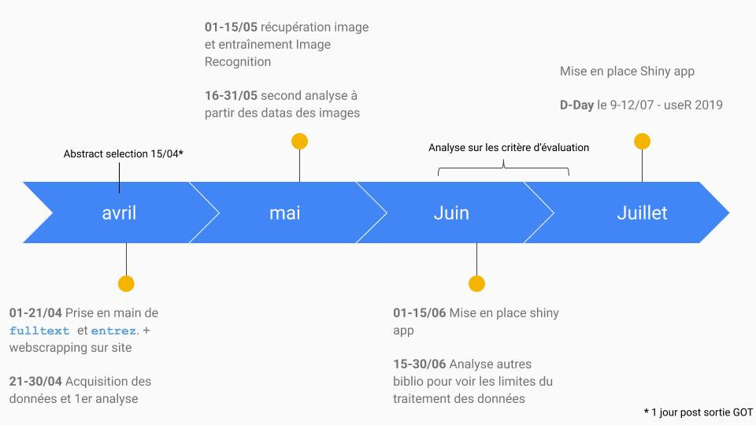

# BibliographeR : a set of tools to help your bibliographic research

Date: 2019-02-29

## Abstract

The number of scientific articles is constantly increasing. It is sometimes impossible to read all the articles in certain areas. Among this great diversity of articles, some may be more interesting than others. It is difficult to select which articles are essential in a field. The contemporary way to judge the scientific quality of an article is to use the impact factor or the number of citations. However, these parameters may lead to a lack of certain articles that are not very well cited but are very innovative. It is therefore essential to ask the question of what makes an article fundamental in a field. Using the "fulltext" package in our Shiny web application we show how the analysis of a bibliography using a network is a good way to visualize the state of the art in a field.  We  searched for different parameters to judge scientific quality using data science approaches. Recent research has shown that the work of small research teams can lead to scientific innovations. In this sense, the analysis of scientific articles by global techniques could play an important role in the discovery of these advances.

- [Resultats](https://github.com/propan2one/BibliographeR/blob/master/results/NOTEBOOK-resultats.md)

- [src](https://github.com/propan2one/BibliographeR/blob/master/src/)

- [raw](https://github.com/propan2one/BibliographeR/blob/master/raw/)

- [doc](https://github.com/propan2one/BibliographeR/blob/master/doc/)

## Mise en place du projet

Idéalement, il va falloir s'attaquer à une bibliographie déjà étudié, dans mon cas j'ai celle d'une partie de mon sujet de thèse (que je connais vaguement), avec les 2 mots clés "herpesvirus" + "oyster" :

- 136 articles (seulement !) qui traitent du sujet

- Ces articles sont de 1972 à nos jours

- Présent chez plusieurs publisher avec différent cas de figure (Nature, journaux peu connu etc)

### 1) Utiliser [fulltext](https://github.com/ropensci/fulltext) pour récolter les 1er données sur NCBI avec [entrez](https://github.com/ropensci/rentrez) des différents articles

- les DOI (le lien https)

- Les auteurs (en avec leurs universitées car certains auteurs ont des noms confondant pouvant faussé l'occurence (comme par exemple avec "Li et al")) et l'université pourrait être un facteur à prendre en compte pour traiter des petite team (genre à interpréter avec le classement de Shangai)

- Les mots clé

- Les résumés

- Autres (les futurs chose qui nous viendrons surment à l'esprit !)

### 2) A partir des DOI, webscrapper (il va peut être falloir passé par des `if` pour gérer les différents cas de balises)

- Les figures sur les sites, en les nomant par leurs numéros (donc la balise pour les noms de plots ?)!

- La liste des **références** (articles associé et auteurs cités) pour faire le réseau

- Comment on traite les datas d'articles inaccessible (aka on peut pas ce rendre sur le DOI, vieux articles)

### 3) Traitements des données scrapper générer

- Courbes d'évolution (par années / mois) des articles en fonctions des thèmes
    - Pour 1 mots clé données
    - Pour les mots clé associé (d'ou le réseau ?)
    - Par rapport à l'évolution dans le temps, existe t'il des mois plus propice à la publication d'articles que d'autre du coup ? (A noel publié c'est plus simple :p)

Optionnel ; 
- Quelles sont les mots clés avec le plus grands nombre d'articles, je parie que cancérologie est en bonne position !! (voir, faire un top10)

- Peut ont créer une bibliothèque de mots clé commun par thème (biologie/math etc..)

    - Parler à des scientifiques de différents domaines pour essayé avoir le type de d'analyse pour une expérience donnée

### 4) Travailler sur des techniques d'image recognition pour classifer les plots

- Déterminer la base de données d'images, c'est à dire sur quelles plots on va utiliser (tradeoff plot utile vs image dispo), on peut ce baser sur les [classiques](https://www.datanovia.com/en/blog/ggplot-examples-best-reference/) et en rajouter par la suite.

- La base de données d'images à générer en scrappant Google images et en récupérerant genre 1000 images des différentes catégorie de plots.

**Remarque** : à garder en tête pour l'analyse global des datas :

### 5) Critère d'évaluations d'un article

- Impact factor

- Citations

- Les retweets !!

- On peut essayer de catégoriser comment les plots ont été généré (graphprisme / STAT/ matplotlib / R, [les utilisateur de R on évidemment un score plus haut xD]

- Type de journal : Journaux open source, journaux bizarre etc..

- On pourra voir quels sont les liens entre les plots : une line plot va t'il être suivie par un heatmap ? (on tente une chaine de makrov ?)
    - On peut aussi catégoriser la suite de plot/analyse pour un type d'expérience donnée (exemple pour une Transcriptomic analysis : line plot (abondance de transcrit) suivie de heatmap suivie de d'analyse GOterm)

## Organisation 

- retroplanning avant deadline 

- Déploiment d'une appli shiny (allé voir shinyapp.io)

## Deadline

- Abstract selection - April 15, 2019

- Slides must be sent to slides@user2019.fr no later than June, 21.

- useR! 2019 Toulouse - France July 9-12, 2019

## Bibliographie

https://www.nature.com/articles/d41586-019-00350-3 
https://lingfeiwu.github.io/smallTeams/#next
